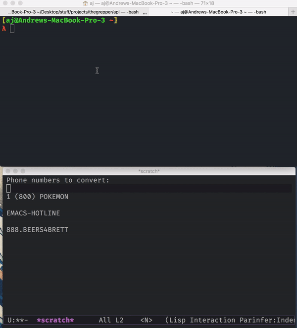

A stupid simple Node module that listens on the command line for a "vanity" number and copies the converted phone number to your system clipboard.

For example:

```
(855) CALL-NOW  ->  8552255669
BEERS4BRETT     ->  2337742738
```

# kill-vanity-phone

I created this for work, where I often have to convert phone numbers on the fly to look them up in our database.

## Usage

`kill-vanity-phone` is a command-line tool. To install it do:

```
npm i -g kill-vanity-phone
```

Then to use it do:

```
kill-vanity-phone
```

You will be prompted to paste or type a value that will be converted to a phone number and copied to your clipboard.




The program loops until you `Ctrl+C` or `Ctrl+D` to end the process.

## Features

- Listens continuously for better workflow (using readline.createInterface)

- Strips non-numeric / non-alphabetic characters

- Strips extra characters (to deal with vanity numbers that add letters for semantic meaning)

- Uses `copy-paste` to work with native system clipboard (works on OS X, Windows, Linux and OpenBSD)

- Super thin; only dependency is [node-copy-paste](https://www.npmjs.com/package/copy-paste) (and obviously [Node.js](https://nodejs.org))

- Removes 1 from the beginning of the number if it is there

### Note:

Only supports countries with 10-digit phone numbers, as it strips anything longer and will treat superfluous characters as part of the output for countries with shorter phone numbers.

This can easily be changed by editing index.js to change the second argument to `substr`, in this case `10`.

## License

Distributed under the BSD License.

### Contributing

Feel free to open an issue/PR if you find a bug or want to support a feature that you think should be added!
